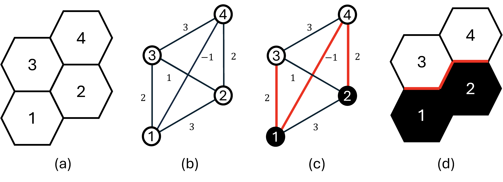

Balancing Interference and Correlation in Spatial Experimental Designs: A Causal Graph Cut Approach
---------------

This repository contains the implementation for the paper "[Balancing Interference and Correlation in Spatial Experimental Designs: A Causal Graph Cut Approach](https://icml.cc/virtual/2025/poster/43725)" (ICML 2025) in Python.

### Summary of the paper

This paper focuses on the design of spatial experiments to optimize the amount of information derived from the experimental data and enhance the accuracy of the resulting causal effect estimator. We propose a surrogate function for the mean squared error of the estimator, which facilitates the use of classical graph cut algorithms to learn the optimal design. Our proposal offers three key advances: (1) it accommodates moderate to large spatial interference effects; (2) it adapts to different spatial covariance functions; (3) it is computationally efficient.



### Reproduction guidance

- Change your working directory to this main folder, run `setup.sh` to configure the environment and install all requirements.
- `./figure3b.sh` --> reproduce Figure 3(b)
- `./figure6&8.sh` --> reproduce Figure 6 and Figure 8
- `./figure7.sh` --> reproduce Figure 7

### Usage the proposed method

If you can assess the environment, then you can follow these steps:

```python
### 1. configure the double robust estimator
from sklearn.ensemble import RandomForestRegressor
from semi_sp_design import SemiEstimator

model = RandomForestRegressor(random_state=0, n_estimators=10)
semi_est = SemiEstimator(n_splits=2, model=model)

### 2. get spatial clusters by causal graph cut
from SemiGraphCut import multi_graph_cut

W = env.get_adj_matrix()
V = env.get_cov_matrix()
spat_cluster, _ = multi_graph_cut(W=W, V=V)

### 3. get the ATE estimation based on the cluster design
c_design = ClusterDesign(p=0.5, W=W, cluster=spat_cluster)
semi_est.update_design(c_design)
hat_tau_C, _ = semi_est.estimate(your_env, N=100)
print("Estimator:", hat_tau_C)
```

### Citation

Please cite our paper [Balancing Interference and Correlation in Spatial Experimental Designs: A Causal Graph Cut Approach (ICML 2025)](https://icml.cc/virtual/2025/poster/43725)

```
@inproceedings{zhu2025balancing,
  title={Balancing Interference and Correlation in Spatial Experimental Designs: A Causal Graph Cut Approach},
  author={Zhu, Jin and Li, Jingyi and Zhou, Hongyi and Lin, Yinan and Lin, Zhenhua and Shi, Chengchun},
  booktitle={International Conference on Machine Learning},
  year={2025},
  organization={PMLR}
}
```
